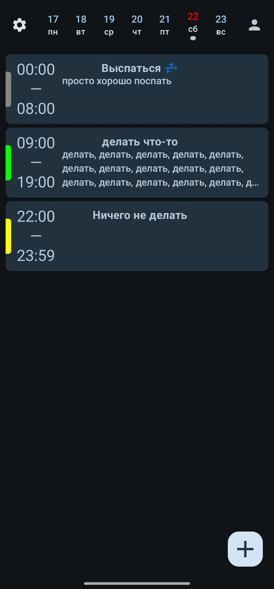
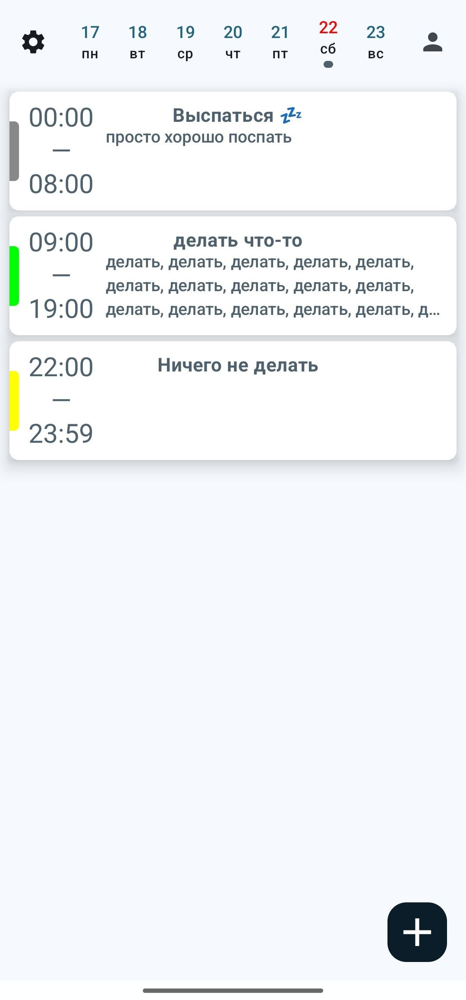

# 📝 TodayList

## 🌟 General Description
todo

### 📑 App Functionality:

1. **todo**:
   - todo

## 💻 Examples of Work
### Example 1: [Main screen]

### Example 2: [Main screen (empty)]

### Example 2: [Add task]

