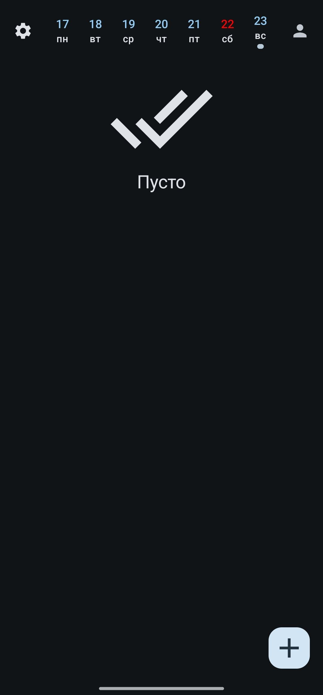
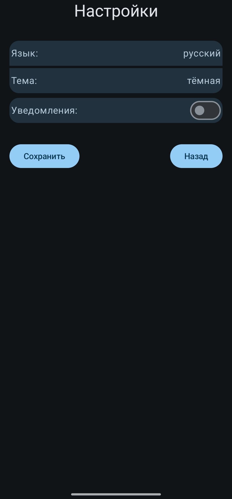

# 📝 TodayList

## 🌟 General Description
TodayList is a convenient daily planner for Android that helps users organize their tasks and plans for each day. Utilizing modern technologies such as Kotlin, Jitpack Compose, and Room, the app offers an intuitive interface and high performance. Users can easily add, view, and delete tasks, set reminders, making time management simple and effective. TodayList is your reliable assistant in planning and achieving your goals!

## 💻 Examples of Work
### Example 1: [Main screen]

### Example 2: [Main screen (empty)]

### Example 3: [Add task]

### Example 4: [App setings]

